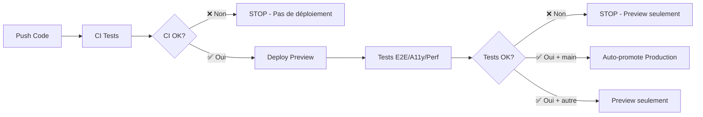

<!-- @format -->

# 🚀 Documentation CI/CD - ArgentBank

## 📋 Vue d'ensemble

Cette documentation décrit la stratégie de déploiement continu (CI/CD) pour le projet ArgentBank avec GitHub Actions et Vercel, en tenant compte de la configuration Root Directory.

## 🏗️ Architecture CI/CD

### Configuration Vercel actuelle

```yaml
Configuration Vercel:
├── Root Directory: P11-ArgentBank/
├── Build Command: pnpm build
├── Output Directory: dist/
├── Install Command: pnpm install
└── Node.js Version: 18.x
```

### Workflow GitHub Actions proposé (Architecture cible)

```text
Workflow Unique Sécurisé (complete-ci-cd.yml)
├── 🔍 Phase 1: Tests de Base (CI)
│   ├── ESLint (bloquant)
│   ├── TypeScript Check (bloquant)
│   ├── Tests Unitaires (bloquant)
│   └── Build (bloquant)
├── 🚀 Phase 2: Déploiement Preview
│   ├── Deploy Preview Vercel (si Phase 1 OK)
│   └── Récupération URL Preview
├── 🧪 Phase 3: Tests Avancés sur Preview
│   ├── Tests E2E Cypress (bloquant)
│   ├── Tests Accessibilité Pa11y (bloquant - priorité absolue)
│   └── Tests Performance Lighthouse (warning seulement)
├── ✅ Phase 4: Auto-promotion Production
│   ├── Conditions: toutes les phases précédentes OK + branch main
│   └── Déploiement Production automatique
└── 📊 Phase 5: Analyse (parallèle, non-bloquante)
    ├── Coverage Report
    ├── Bundle Size Analysis
    └── Security Audit
```

### Architecture actuelle (workflows séparés - PROBLÈME)

⚠️ **Problème critique identifié :** Les workflows actuels sont indépendants et ne se bloquent pas mutuellement !

```text
État actuel DANGEREUX:
├── ci.yml → Peut échouer ❌
├── accessibility-performance.yml → Peut échouer ❌
└── deploy.yml → DÉPLOIE QUAND MÊME ✅ (PROBLÈME!)
```

**Conséquence :** Le déploiement production peut se faire même si les tests d'accessibilité ou les tests unitaires échouent !

## 📁 Structure des workflows

### **Architecture actuelle (workflows séparés)**

```text
.github/workflows/
├── ci.yml                         # Tests de base (lint, typecheck, test, build)
├── deploy.yml                     # Déploiement Vercel (preview/production)
├── accessibility-performance.yml  # Tests E2E, Lighthouse, Pa11y
└── analysis.yml                   # Coverage, bundle, security
```

### **Architecture cible (workflow unique sécurisé)**

```text
.github/workflows/
├── complete-ci-cd.yml            # Workflow unique avec toutes les étapes
├── [LEGACY] ci.yml               # À supprimer après migration
├── [LEGACY] deploy.yml           # À supprimer après migration
├── [LEGACY] accessibility-performance.yml # À supprimer après migration
└── analysis.yml                  # Conservé (optionnel, non-bloquant)
```

## 🎯 Stratégie de déploiement (Architecture cible)

### Branches et environnements (Workflow unique sécurisé)

| Branch      | Environnement | Action Workflow Unique                | URL                                   |
| ----------- | ------------- | ------------------------------------- | ------------------------------------- |
| `main`      | Production    | CI → Preview → Tests → Auto-promote   | https://slm-argentbank.vercel.app     |
| `develop`   | Staging       | CI → Preview → Tests (sans promotion) | https://slm-argentbank-git-develop... |
| `feature/*` | Preview       | CI → Preview → Tests (sans promotion) | https://slm-argentbank-git-feature... |

### Logique Preview First (sécurisée)



### Déclencheurs (Workflow unique)

**CI/CD s'exécute sur :**

- ✅ Push sur `main` → CI + Preview + Tests + Auto-promotion Production
- ✅ Push sur `develop` → CI + Preview + Tests (sans promotion)
- ✅ Pull Requests vers `main` ou `develop` → CI + Preview + Tests (sans promotion)
- ✅ Manuellement (workflow_dispatch)

**Avantages :**

- 🛡️ **Zéro risque** pour la production (tests avant promotion)
- 🔄 **Dépendances claires** entre les phases
- ⚡ **Performance optimisée** (pas de duplication setup)
- 🧪 **Tests sur environnement réel** Vercel

### Conditions de blocage

**Tests bloquants (empêchent la promotion) :**

- ❌ **ESLint errors** (lint)
- ❌ **TypeScript errors** (typecheck)
- ❌ **Unit tests failures** (test)
- ❌ **Build failures** (build)
- ❌ **E2E tests failures** (Cypress)
- ❌ **Accessibility failures** (Pa11y - PRIORITÉ ABSOLUE)

**Tests non-bloquants (warning seulement) :**

- ⚠️ **Performance < 70%** (Lighthouse - warning)
- ⚠️ **Bundle size increase > 10%** (warning)

## 🧪 Stratégie de tests par environnement

### Tests sur Pull Request

```yaml
Tests obligatoires (PR blocking):
├── ✅ Lint (ESLint)
├── ✅ Type Check (TypeScript)
├── ✅ Unit Tests (Vitest)
├── ✅ Integration Tests (Vitest)
├── ✅ Accessibility Tests (Axe intégré)
└── ✅ Build Success
```

### Tests sur main/develop

```yaml
Tests complets:
├── Tous les tests PR +
├── 📊 Coverage Report
├── 🔍 Security Audit
├── 📦 Bundle Analysis
└── 🚀 Deploy Success Check
```

### Tests d'accessibilité et performance (obligatoires)

```yaml
Tests d'accessibilité et performance:
├── 🏃 E2E Tests (Cypress) - Obligatoire
├── ⚡ Lighthouse Performance - Obligatoire
├── ♿ Pa11y Accessibility - Obligatoire (priorité absolue)
└── 🔄 Visual Regression Tests - Optionnel
```

## ⚙️ Configuration détaillée

### Variables d'environnement requises

```bash
# GitHub Secrets nécessaires
VERCEL_TOKEN=              # Token Vercel pour déploiement
VERCEL_ORG_ID=            # ID de l'organisation Vercel
VERCEL_PROJECT_ID=        # ID du projet Vercel

# Variables d'environnement projet
NODE_ENV=production
API_BASE_URL=             # URL de l'API backend
```

### Working Directory

**Important :** Tous les jobs doivent utiliser le bon répertoire de travail :

```yaml
defaults:
  run:
    working-directory: P11-ArgentBank
```

### Cache Strategy

```yaml
Cache Configuration:
├── Node Modules: ~/.pnpm-store
├── TypeScript: P11-ArgentBank/tsconfig.app.tsbuildinfo
├── Vite Build: P11-ArgentBank/node_modules/.vite
└── Coverage: P11-ArgentBank/coverage
```

## 📊 Métriques et reporting

### Badges de statut (README)

```markdown


```

### Reports générés

- **Coverage Report** : Couverture de code détaillée
- **Bundle Analysis** : Taille et composition du bundle
- **Test Results** : Résultats détaillés des tests
- **Security Report** : Audit de sécurité des dépendances

## 🚀 Plan d'implémentation progressive (Architecture cible)

### Phase 1 : Création du workflow unique sécurisé ✅ (Nouvelle approche)

```yaml
complete-ci-cd.yml:
├── Job: ci-tests
│   ├── ESLint (bloquant)
│   ├── TypeScript (bloquant)
│   ├── Tests unitaires (bloquant)
│   └── Build (bloquant)
├── Job: deploy-preview
│   ├── Dépend de: ci-tests (needs: ci-tests)
│   ├── Deploy Vercel Preview
│   └── Récupération URL Preview
├── Job: accessibility-tests
│   ├── Dépend de: deploy-preview (needs: deploy-preview)
│   ├── Cypress E2E (bloquant)
│   ├── Pa11y Accessibility (bloquant)
│   └── Lighthouse Performance (warning)
└── Job: promote-production
    ├── Dépend de: [ci-tests, accessibility-tests]
    ├── Condition: success() && github.ref == 'refs/heads/main'
    └── Promotion automatique vers production
```

### Phase 2 : Migration progressive (sécurisée)

```yaml
Étape 2.1: Tester le nouveau workflow
├── Créer complete-ci-cd.yml
├── Tester sur une branche feature
├── Valider toutes les phases
└── Ajuster si nécessaire

Étape 2.2: Désactiver temporairement les anciens workflows
├── Renommer ci.yml → ci.yml.disabled
├── Renommer deploy.yml → deploy.yml.disabled
├── Renommer accessibility-performance.yml → accessibility-performance.yml.disabled
└── Tester complete-ci-cd.yml en production

Étape 2.3: Validation et nettoyage
├── Valider sur plusieurs commits
├── Vérifier les performances
├── Supprimer les anciens workflows si OK
└── Mettre à jour la documentation
```

### Phase 3 : Tests et optimisation

```yaml
Optimisations:
├── 📊 Parallélisation des jobs indépendants
├── 📦 Optimisation du cache
├── ⚡ Réduction des temps d'exécution
└── 🔍 Monitoring des performances
```

## 🔧 Configuration des outils

### ESLint pour CI

```json
{
  "scripts": {
    "lint": "eslint . --ext .ts,.tsx --report-unused-disable-directives --max-warnings 0",
    "lint:ci": "eslint . --ext .ts,.tsx --format json --output-file eslint-report.json"
  }
}
```

### Vitest pour CI

```json
{
  "scripts": {
    "test": "vitest run",
    "test:ci": "vitest run --coverage --reporter=verbose --reporter=json --outputFile=test-results.json"
  }
}
```

### TypeScript pour CI

```json
{
  "scripts": {
    "typecheck": "tsc --noEmit",
    "typecheck:ci": "tsc --noEmit --pretty false"
  }
}
```

## 🐛 Dépannage

### Problèmes courants

1. **Working Directory incorrect**

   - Solution : Vérifier `working-directory: P11-ArgentBank`

2. **Cache invalide**

   - Solution : Versionner les clés de cache

3. **Timeouts de tests**

   - Solution : Augmenter le timeout ou paralléliser

4. **Problèmes de dépendances**
   - Solution : Lock file à jour et cache pnpm

### Debug des workflows

```bash
# Activer les logs de debug GitHub Actions
ACTIONS_STEP_DEBUG=true
ACTIONS_RUNNER_DEBUG=true
```

## 📝 Bonnes pratiques

### Sécurité

- ✅ Utiliser des secrets GitHub pour les tokens
- ✅ Limiter les permissions des workflows
- ✅ Audit régulier des dépendances
- ✅ Pas de données sensibles dans les logs

### Performance

- ✅ Utiliser le cache pour node_modules
- ✅ Paralléliser les jobs indépendants
- ✅ Optimiser la taille des images Docker
- ✅ Limiter la durée des tests

### Maintenance

- ✅ Documenter les workflows
- ✅ Versionner les actions utilisées
- ✅ Monitorer les temps d'exécution
- ✅ Nettoyer les artifacts anciens

## 🎯 Objectifs de performance

### Temps d'exécution cibles

- **Lint + TypeCheck** : < 2 minutes
- **Tests unitaires** : < 5 minutes
- **Build** : < 3 minutes
- **Tests d'accessibilité** : < 4 minutes (Pa11y + Axe intégré)
- **Tests E2E** : < 8 minutes (Cypress)
- **Tests de performance** : < 6 minutes (Lighthouse)
- **Déploiement** : < 2 minutes (en parallèle avec tests)
- **Total CI complet** : < 15 minutes

### Métriques de succès

- **Success Rate** : > 95% (taux de PR qui passent sans intervention)
- **MTTR** (Mean Time To Recovery) : < 30 minutes
- **Feedback Time** : < 10 minutes (temps de retour sur PR)
- **False Positive Rate** : < 5% (tests qui échouent à tort)
- **Accessibilité** : 100% conforme WCAG 2.1 AA (priorité absolue)

---

## 🚀 Prochaines étapes

1. **Créer le workflow CI de base** (Phase 1)
2. **Tester avec une PR simple**
3. **Ajouter le déploiement automatique** (Phase 2)
4. **Itérer et améliorer** progressivement

---

**Dernière mise à jour** : 11 juin 2025
**Mainteneur** : Équipe ArgentBank
