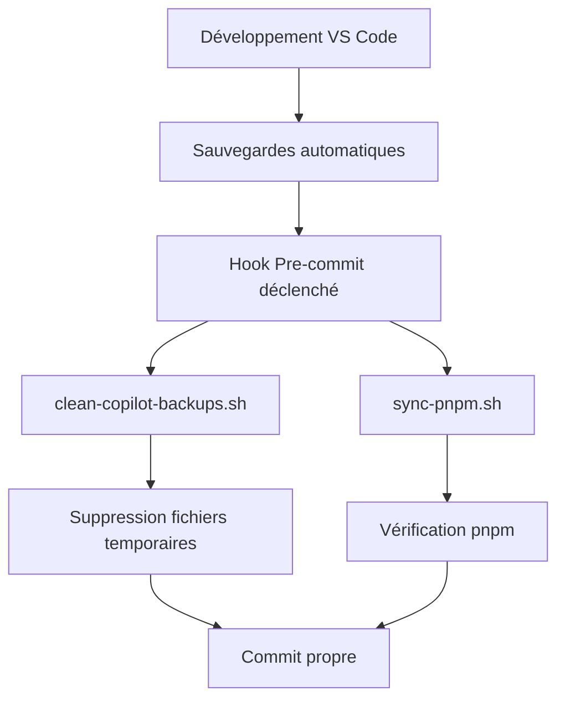

<!-- @format -->

# 🤖 Guide Complet : Gestion des Sauvegardes GitHub Copilot avec pnpm

> **Problème résolu** : Conflits de sauvegardes Copilot/VS Code lors des redémarrages et commits avec pnpm

## 📋 Table des Matières

1. [Problème Initial](#problème-initial)
2. [Solutions Implémentées](#solutions-implémentées)
3. [Installation et Configuration](#installation-et-configuration)
4. [Utilisation Quotidienne](#utilisation-quotidienne)
5. [Résolution des Problèmes](#résolution-des-problèmes)
6. [Architecture Technique](#architecture-technique)
7. [FAQ](#faq)

---

## 🚨 Problème Initial

### Symptômes Observés

- ✗ Anciennes sauvegardes de fichiers réapparaissent au redémarrage de VS Code
- ✗ Conflits entre npm et pnpm (package-lock.json vs pnpm-lock.yaml)
- ✗ Sauvegardes Copilot non synchronisées avec l'état Git
- ✗ Cache VS Code corrompu causant des incohérences

### Causes Racines

- **VS Code** : `files.hotExit` activé par défaut
- **Copilot** : Sauvegardes automatiques non nettoyées
- **Gestionnaire de paquets** : Mélange npm/pnpm dans le même projet
- **Cache** : Accumulation de fichiers temporaires

---

## ✅ Solutions Implémentées

### 1. Configuration VS Code Optimisée

**Fichier** : `.vscode/settings.json`

```json
{
  "files.hotExit": "off",
  "npm.packageManager": "pnpm",
  "files.exclude": {
    "**/.vscode/workspaceStorage": true,
    "**/.history": true,
    "**/*.backup": true,
    "**/*.autosave": true
  }
}
```

**Bénéfices** :

- ✅ Désactive les sauvegardes automatiques à la fermeture
- ✅ Force l'utilisation de pnpm
- ✅ Masque les fichiers temporaires

### 2. Scripts de Nettoyage Automatique

#### 🧹 Nettoyage des Sauvegardes Copilot

**Script** : `scripts/clean-copilot-backups.sh`

```bash
pnpm run clean:copilot
# ou directement
bash scripts/clean-copilot-backups.sh
```

**Actions** :

- Supprime `*.backup`, `*.bak`, `*.autosave`
- Nettoie `.vscode/workspaceStorage/`
- Supprime `.history/`
- Élimine les fichiers système (`.DS_Store`, etc.)

#### 🔄 Synchronisation pnpm

**Script** : `scripts/sync-pnpm.sh`

```bash
pnpm run sync:pnpm
```

**Actions** :

- Vérifie l'intégrité du `pnpm-lock.yaml`
- Nettoie le store pnpm
- Recharge la configuration TypeScript
- Détecte les conflits npm/pnpm

#### 🚀 Préparation de Commit

**Commande intégrée** :

```bash
pnpm run commit-ready
```

**Workflow** :

1. Nettoie les sauvegardes Copilot
2. Synchronise avec pnpm
3. Affiche l'état Git propre

### 3. Hook Pre-commit Automatique

**Installation** :

```bash
bash scripts/install-git-hooks.sh
```

**Actions automatiques avant chaque commit** :

- ✅ Nettoie les sauvegardes VS Code/Copilot
- ✅ Détecte et supprime `package-lock.json`
- ✅ Vérifie que pnpm est utilisé
- ✅ Exécute les linters (ESLint)
- ✅ Formate le code (Prettier)

### 4. Gitignore Mis à Jour

**Nouveaux patterns ignorés** :

```gitignore
# Sauvegardes VS Code et Copilot
.vscode/workspaceStorage/
.history/
*.backup
*.bak
*.autosave

# Conflits de package managers
package-lock.json
yarn.lock

# Cache VS Code
.vscode/settings.backup
.vscode/launch.backup
.vscode/tasks.backup
```

---

## 🛠️ Installation et Configuration

### Étape 1 : Installation du Hook Pre-commit

```bash
cd /path/to/your/project
bash scripts/install-git-hooks.sh
```

### Étape 2 : Vérification de la Configuration

```bash
# Vérifier les paramètres VS Code
cat .vscode/settings.json | grep -E "(hotExit|packageManager)"

# Tester le nettoyage
pnpm run clean:copilot

# Vérifier le gitignore
grep -A 10 "Sauvegardes VS Code" .gitignore
```

### Étape 3 : Test du Workflow

```bash
# Test complet
pnpm run commit-ready

# Vérifier l'état
git status

# Test du hook (simulation)
.git/hooks/pre-commit
```

---

## 🚀 Utilisation Quotidienne

### Workflow Standard

```bash
# 1. Développement normal dans VS Code
# ...coder, sauvegarder, etc...

# 2. Avant de fermer VS Code ou faire un commit
pnpm run commit-ready

# 3. Commit normal (hook automatique)
git add .
git commit -m "feat: nouvelle fonctionnalité"
```

### Commandes Essentielles

| Action                 | Commande                 | Description                     |
| ---------------------- | ------------------------ | ------------------------------- |
| **Nettoyage rapide**   | `pnpm run clean:copilot` | Supprime toutes les sauvegardes |
| **Sync pnpm**          | `pnpm run sync:pnpm`     | Synchronise avec pnpm           |
| **Préparation commit** | `pnpm run commit-ready`  | Workflow complet                |
| **Test hook**          | `.git/hooks/pre-commit`  | Test manuel du hook             |

### Scripts Package.json Disponibles

```json
{
  "scripts": {
    "clean:copilot": "bash scripts/clean-copilot-backups.sh",
    "sync:pnpm": "bash scripts/sync-pnpm.sh",
    "commit-ready": "pnpm run clean:copilot && pnpm run sync:pnpm && git status",
    "install:hooks": "bash scripts/install-git-hooks.sh"
  }
}
```

---

## 🔧 Résolution des Problèmes

### Problème : package-lock.json Réapparaît

**Symptôme** : Le fichier `package-lock.json` est créé malgré l'utilisation de pnpm

**Solution** :

```bash
# Suppression automatique par le hook
# Ou manuellement :
rm package-lock.json
pnpm install

# Vérifier la configuration npm
npm config get package-lock
npm config set package-lock false --global
```

### Problème : Sauvegardes Corrompues

**Symptôme** : VS Code charge d'anciennes versions de fichiers

**Solution** :

```bash
# Nettoyage complet
pnpm run clean:copilot

# Nettoyage manuel si nécessaire
rm -rf .vscode/workspaceStorage/
rm -rf .history/

# Redémarrer VS Code
```

### Problème : Cache pnpm Corrompu

**Symptôme** : Erreurs d'installation ou dépendances manquantes

**Solution** :

```bash
# Nettoyage du store pnpm
pnpm store prune

# Réinstallation propre
rm -rf node_modules/
pnpm install

# Vérification de l'intégrité
pnpm install --frozen-lockfile
```

### Problème : Hook Pre-commit Ne S'exécute Pas

**Symptôme** : Le hook ne se déclenche pas lors des commits

**Solution** :

```bash
# Vérifier l'existence du hook
ls -la .git/hooks/pre-commit

# Réinstaller si nécessaire
bash scripts/install-git-hooks.sh

# Vérifier les permissions
chmod +x .git/hooks/pre-commit

# Test manuel
.git/hooks/pre-commit
```

### Problème : Conflits Git Persistants

**Symptôme** : Git détecte des modifications sur des fichiers de sauvegarde

**Solution** :

```bash
# Nettoyage Git complet
git clean -fdx --exclude=node_modules

# Réinitialiser le gitignore
git rm --cached -r .
git add .gitignore
git add .

# Commit propre
git commit -m "fix: nettoie les sauvegardes et applique gitignore"
```

---

## 🏗️ Architecture Technique

### Structure des Fichiers

```
📁 scripts/
├── 🧹 clean-copilot-backups.sh    # Nettoyage des sauvegardes
├── 🔄 sync-pnpm.sh                # Synchronisation pnpm
├── 🔧 install-git-hooks.sh        # Installation des hooks
└── 📋 pre-commit-hook.sh           # Hook pre-commit

📁 .vscode/
└── ⚙️ settings.json                # Configuration VS Code

📄 .gitignore                       # Patterns d'exclusion
📄 COPILOT_MANAGEMENT_GUIDE.md      # Cette documentation
```

### Flux de Données



### Scripts et Responsabilités

#### `clean-copilot-backups.sh`

- **Rôle** : Nettoyage des sauvegardes
- **Entrée** : État actuel du workspace
- **Sortie** : Workspace nettoyé
- **Fréquence** : Avant chaque commit + manuel

#### `sync-pnpm.sh`

- **Rôle** : Synchronisation pnpm
- **Entrée** : Configuration du projet
- **Sortie** : État pnpm cohérent
- **Fréquence** : Avant commit + dépannage

#### `pre-commit-hook.sh`

- **Rôle** : Orchestration du workflow
- **Entrée** : Intention de commit
- **Sortie** : Validation ou rejet
- **Fréquence** : Automatique à chaque commit

---

## ❓ FAQ

### Q : Pourquoi désactiver `files.hotExit` ?

**R** : `files.hotExit` sauvegarde automatiquement l'état des fichiers ouverts lors de la fermeture de VS Code. Cela peut créer des conflits avec Git et Copilot, car les anciennes versions des fichiers peuvent être restaurées au lieu des versions actuelles du repository.

### Q : Le hook va-t-il ralentir mes commits ?

**R** : Les scripts sont optimisés pour être rapides (< 5 secondes). Le gain en qualité et consistance compense largement ce petit délai.

### Q : Que se passe-t-il si je travaille sur plusieurs branches ?

**R** : Le hook et les scripts sont agnostiques aux branches. Ils nettoient les sauvegardes quelle que soit la branche active, assurant une consistance globale.

### Q : Puis-je désactiver temporairement le hook ?

**R** : Oui, plusieurs options :

```bash
# Option 1 : Commit avec --no-verify
git commit --no-verify -m "commit sans hook"

# Option 2 : Désactiver temporairement
mv .git/hooks/pre-commit .git/hooks/pre-commit.disabled

# Option 3 : Réactiver
mv .git/hooks/pre-commit.disabled .git/hooks/pre-commit
```

### Q : Le système fonctionne-t-il avec d'autres éditeurs ?

**R** : Les scripts sont agnostiques à l'éditeur. Cependant, la configuration spécifique VS Code ne s'applique qu'à VS Code. Pour d'autres éditeurs, seuls les scripts de nettoyage seront utiles.

### Q : Comment migrer d'un projet npm vers cette configuration ?

**R** :

```bash
# 1. Supprimer les artifacts npm
rm package-lock.json
rm -rf node_modules/

# 2. Installer pnpm si nécessaire
npm install -g pnpm

# 3. Installer les dépendances avec pnpm
pnpm install

# 4. Installer la configuration
bash scripts/install-git-hooks.sh

# 5. Premier nettoyage
pnpm run commit-ready
```

---

## 🎯 Bonnes Pratiques

### À Faire ✅

1. **Toujours utiliser pnpm** dans ce projet
2. **Exécuter `pnpm run commit-ready`** avant les commits importants
3. **Laisser le hook pre-commit activé** pour la cohérence de l'équipe
4. **Nettoyer régulièrement** avec `pnpm run clean:copilot`

### À Éviter ❌

1. **Ne pas utiliser npm** dans ce projet pnpm
2. **Ne pas contourner le hook** sauf cas exceptionnels
3. **Ne pas ignorer les avertissements** du script de synchronisation
4. **Ne pas modifier manuellement** `.vscode/workspaceStorage/`

### Pour l'Équipe 👥

1. **Documenter les changements** dans les scripts d'équipe
2. **Former les nouveaux développeurs** à ce workflow
3. **Maintenir la cohérence** des configurations VS Code
4. **Monitorer les performances** des scripts lors des montées en charge

---

## 📈 Métriques et Monitoring

### Indicateurs de Succès

- **Réduction des conflits** : Moins de merge conflicts sur les fichiers de configuration
- **Consistency des builds** : Absence de `package-lock.json` dans les commits
- **Rapidité du workflow** : Scripts terminant en moins de 5 secondes
- **Adoption par l'équipe** : 100% des développeurs utilisant le hook

### Logs et Débogage

```bash
# Vérifier l'activité du hook
ls -la .git/hooks/ | grep pre-commit

# Logs des derniers nettoyages (si implémenté)
tail -f /tmp/copilot-cleanup.log

# Analyser les performances
time pnpm run commit-ready
```

---

## 🔄 Maintenance et Évolution

### Mises à Jour Périodiques

- **Mensuel** : Vérifier les nouvelles versions de pnpm et leurs impacts
- **Trimestriel** : Réviser les patterns du `.gitignore`
- **Semestriel** : Optimiser les performances des scripts

### Amélioration Continue

- Collecter les retours de l'équipe sur le workflow
- Optimiser les scripts selon les nouveaux besoins
- Intégrer de nouveaux outils (pre-push hooks, CI/CD, etc.)

---

## 📚 Ressources Complémentaires

- [Documentation pnpm](https://pnpm.io/motivation)
- [VS Code Settings Reference](https://code.visualstudio.com/docs/getstarted/settings)
- [Git Hooks Documentation](https://git-scm.com/book/en/v2/Customizing-Git-Git-Hooks)
- [GitHub Copilot Best Practices](https://docs.github.com/en/copilot)

---

**✨ Avec cette configuration, vos sauvegardes Copilot sont gérées automatiquement et vous évitez tous les conflits !**

_Dernière mise à jour : 31 mai 2025_
