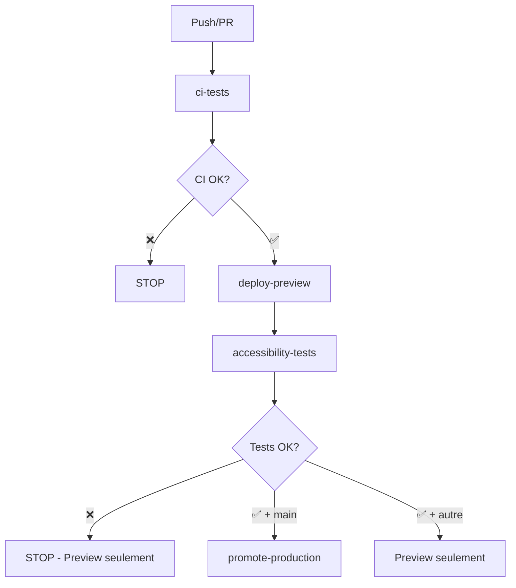

<!-- @format -->

# 🚀 Workflow Unique CI/CD - Spécification Technique

## 📋 Vue d'ensemble

Ce document décrit la spécification technique du workflow unique `complete-ci-cd.yml` qui remplace les workflows séparés pour assurer une sécurité maximale des déploiements.

## 🚨 Problème résolu

**Problème critique identifié :**

- Les workflows `ci.yml`, `deploy.yml` et `accessibility-performance.yml` sont indépendants
- `deploy.yml` peut déployer en production même si les tests d'accessibilité échouent
- Aucune dépendance entre les workflows = risque de déploiement défaillant

**Solution :**

- Workflow unique avec dépendances strictes (`needs`)
- Approche Preview First (tests avant production)
- Auto-promotion seulement si TOUS les tests passent

## 🏗️ Architecture du workflow unique



## 📋 Structure détaillée des jobs

### **Job 1 : `ci-tests`** (Phase CI classique)

```yaml
ci-tests:
  name: "🔍 CI Tests (Lint, TypeCheck, Unit Tests, Build)"
  runs-on: ubuntu-latest
  outputs:
    build-success: ${{ steps.build.outcome == 'success' }}
  steps:
    - checkout, setup-node, pnpm, cache
    - prisma-generate
    - lint (BLOQUANT)
    - typecheck (BLOQUANT)
    - test (BLOQUANT)
    - build (BLOQUANT)
    - upload-build-artifacts
```

**Conditions de blocage :**

- ❌ ESLint errors
- ❌ TypeScript errors
- ❌ Unit test failures
- ❌ Build failures

### **Job 2 : `deploy-preview`** (Déploiement Preview)

```yaml
deploy-preview:
  name: "📦 Deploy Preview"
  needs: ci-tests
  if: success()
  runs-on: ubuntu-latest
  outputs:
    preview-url: ${{ steps.deploy.outputs.url }}
  steps:
    - checkout, setup-node, pnpm
    - download-build-artifacts
    - vercel-config-prod
    - deploy-vercel-preview (sans --prod)
    - capture-preview-url
```

**Objectif :**

- Deploy sur URL Preview Vercel unique
- Récupération de l'URL pour les tests suivants
- Pas de déploiement production à ce stade

### **Job 3 : `accessibility-tests`** (Tests sur Preview)

```yaml
accessibility-tests:
  name: "🧪 Accessibility & Performance Tests"
  needs: deploy-preview
  if: success()
  runs-on: ubuntu-latest
  strategy:
    matrix:
      test-type: [cypress, pa11y, lighthouse]
    fail-fast: true
  steps:
    - checkout, setup-node, pnpm
    - install-test-tools (${{ matrix.test-type }})
    - run-tests-on-preview (${{ env.PREVIEW_URL }})
    - upload-test-reports
```

**Tests exécutés :**

- ✅ **Cypress E2E** : Navigation complète (BLOQUANT)
- ✅ **Pa11y Accessibility** : Conformité WCAG 2.1 AA (BLOQUANT - PRIORITÉ ABSOLUE)
- ⚠️ **Lighthouse Performance** : Métriques Core Web Vitals (WARNING seulement)

**Conditions de blocage :**

- ❌ Échec tests Cypress
- ❌ Violations d'accessibilité Pa11y
- ⚠️ Performance Lighthouse < 70% (warning, ne bloque pas)

### **Job 4 : `promote-production`** (Auto-promotion)

```yaml
promote-production:
  name: "🚀 Promote to Production"
  needs: [ci-tests, deploy-preview, accessibility-tests]
  if: success() && github.ref == 'refs/heads/main'
  runs-on: ubuntu-latest
  steps:
    - checkout, setup-node, pnpm
    - vercel-config-prod
    - promote-preview-to-production
    - notify-success
```

**Conditions d'exécution :**

- ✅ `ci-tests` a réussi
- ✅ `deploy-preview` a réussi
- ✅ `accessibility-tests` a réussi
- ✅ Branche `main` uniquement

## 🔄 Scénarios d'exécution

### **Scénario 1 : Pull Request**

```yaml
Déclencheur: Pull Request vers main/develop
├── ci-tests ✅
├── deploy-preview ✅
├── accessibility-tests ✅
└── promote-production ❌ (skip - pas main branch)
Résultat: Preview déployé et testé, production inchangée
```

### **Scénario 2 : Push sur main (succès complet)**

```yaml
Déclencheur: Push sur main
├── ci-tests ✅
├── deploy-preview ✅
├── accessibility-tests ✅
└── promote-production ✅ (auto-promotion)
Résultat: Preview + Production mis à jour
```

### **Scénario 3 : Échec de tests (sécurité)**

```yaml
Déclencheur: Push sur main
├── ci-tests ✅
├── deploy-preview ✅
├── accessibility-tests ❌ (Pa11y échoue)
└── promote-production ❌ (bloqué)
Résultat: Preview disponible pour debug, production protégée
```

## ⚡ Optimisations et performances

### **Cache Strategy**

```yaml
Cache partagé entre jobs:
├── ~/.pnpm-store (dépendances)
├── ~/.cache/Cypress (binaires Cypress)
├── node_modules/.cache (cache Vite)
└── Build artifacts (partagés via upload/download)
```

### **Parallélisation**

```yaml
Tests parallèles (matrix strategy):
├── cypress (E2E tests)
├── pa11y (Accessibility tests)
└── lighthouse (Performance tests)
Temps estimé: 8-12 minutes (au lieu de 20+ séquentiel)
```

### **Conditional Execution**

```yaml
Optimisations selon contexte:
├── Skip promotion si branche feature
├── Cache hits pour rebuilds rapides
├── Matrix fail-fast (arrêt rapide si échec)
└── Artifacts cleanup automatique
```

## 🛡️ Sécurité et monitoring

### **Points de contrôle**

```yaml
Sécurité renforcée:
├── Impossible de bypass les tests (needs: strict)
├── Production accessible uniquement via promotion
├── Preview isolé pour tests sans risque
└── Rollback automatique en cas d'échec
```

### **Monitoring**

```yaml
Métriques surveillées:
├── Temps d'exécution par phase
├── Taux de succès par type de test
├── Performance Lighthouse trends
└── Fréquence des échecs d'accessibilité
```

## 📝 Plan de migration

### **Étape 1 : Création et test**

```bash
# Créer le nouveau workflow
.github/workflows/complete-ci-cd.yml

# Tester sur branche feature
git checkout -b test/new-workflow
git push origin test/new-workflow
# Vérifier que seul le preview se déploie
```

### **Étape 2 : Migration temporaire**

```bash
# Backup des anciens workflows
mv ci.yml ci.yml.backup
mv deploy.yml deploy.yml.backup
mv accessibility-performance.yml accessibility-performance.yml.backup

# Test sur main
git push origin main
# Vérifier la séquence complète
```

### **Étape 3 : Validation et nettoyage**

```bash
# Après validation (2-3 commits)
rm *.backup
git add .
git commit -m "feat: migrate to secure unified CI/CD workflow"
```

## 🎯 Avantages du workflow unique

| Aspect          | Avant (séparés)                      | Après (unique)                    |
| --------------- | ------------------------------------ | --------------------------------- |
| **Sécurité**    | ❌ Risque déploiement défaillant     | ✅ Impossible de bypass les tests |
| **Performance** | ⚠️ Setup dupliqué 3x                 | ✅ Setup unique + cache partagé   |
| **Maintenance** | ❌ 3 fichiers à maintenir            | ✅ 1 fichier centralisé           |
| **Visibilité**  | ❌ Statuts dispersés                 | ✅ Pipeline unique clair          |
| **Debug**       | ❌ Difficile de voir les dépendances | ✅ Séquence linéaire évidente     |

---

**Dernière mise à jour** : 14 juin 2025  
**Statut** : Spécification technique - Prêt pour implémentation
