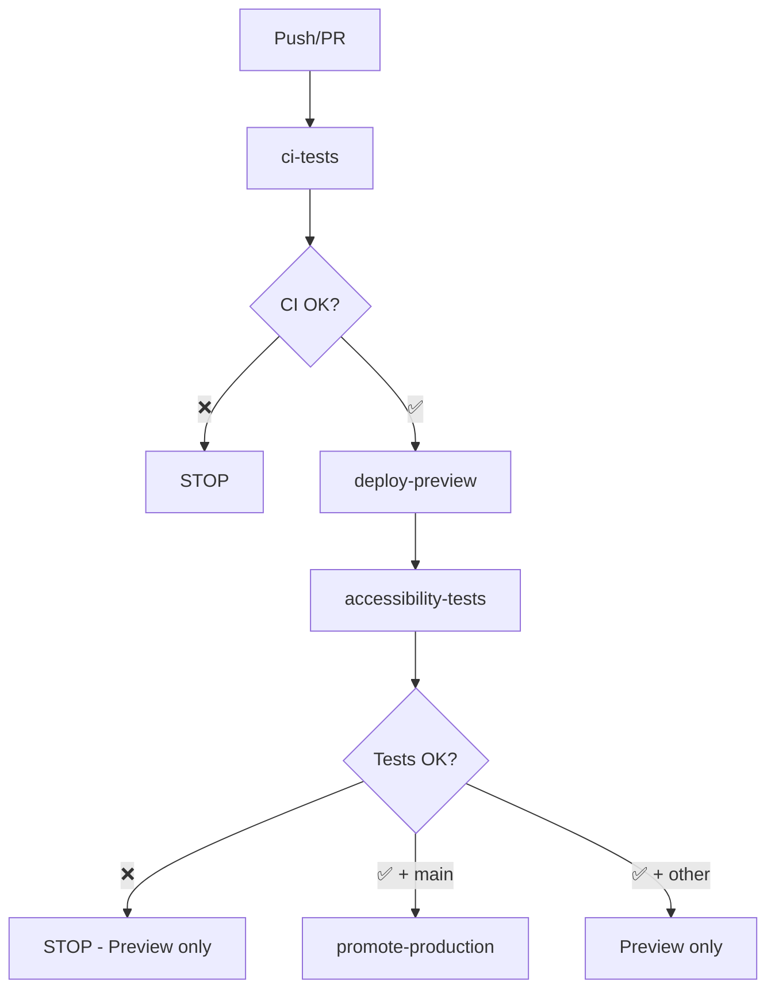

<!-- @format -->

# 🚀 Unified CI/CD Workflow - Technical Specification

## 📋 Overview

This document describes the technical specification of the unified `complete-ci-cd.yml` workflow that replaces separate workflows to ensure maximum deployment security.

## 🚨 Problem solved

**Critical problem identified:**

- `ci.yml`, `deploy.yml` and `accessibility-performance.yml` workflows are independent
- `deploy.yml` can deploy to production even if accessibility tests fail
- No dependencies between workflows = risk of failing deployment

**Solution:**

- Single workflow with strict dependencies (`needs`)
- Preview First approach (tests before production)
- Auto-promotion only if ALL tests pass

## 🏗️ Unified workflow architecture



## 📋 Detailed job structure

### **Job 1: `ci-tests`** (Classic CI phase)

```yaml
ci-tests:
  name: "🔍 CI Tests (Lint, TypeCheck, Unit Tests, Build)"
  runs-on: ubuntu-latest
  outputs:
    build-success: ${{ steps.build.outcome == 'success' }}
  steps:
    - checkout, setup-node, pnpm, cache
    - prisma-generate
    - lint (BLOCKING)
    - typecheck (BLOCKING)
    - test (BLOCKING)
    - build (BLOCKING)
    - upload-build-artifacts
```

**Blocking conditions:**

- ❌ ESLint errors
- ❌ TypeScript errors
- ❌ Unit test failures
- ❌ Build failures

### **Job 2: `deploy-preview`** (Preview deployment)

```yaml
deploy-preview:
  name: "📦 Deploy Preview"
  needs: ci-tests
  if: success()
  runs-on: ubuntu-latest
  outputs:
    preview-url: ${{ steps.deploy.outputs.url }}
  steps:
    - checkout, setup-node, pnpm
    - download-build-artifacts
    - vercel-config-prod
    - deploy-vercel-preview (without --prod)
    - capture-preview-url
```

**Objective:**

- Deploy to unique Vercel Preview URL
- Capture URL for subsequent tests
- No production deployment at this stage

### **Job 3: `accessibility-tests`** (Tests on Preview)

```yaml
accessibility-tests:
  name: "🧪 Accessibility & Performance Tests"
  needs: deploy-preview
  if: success()
  runs-on: ubuntu-latest
  strategy:
    matrix:
      test-type: [cypress, pa11y, lighthouse]
    fail-fast: true
  steps:
    - checkout, setup-node, pnpm
    - install-test-tools (${{ matrix.test-type }})
    - run-tests-on-preview (${{ env.PREVIEW_URL }})
    - upload-test-reports
```

**Tests executed:**

- ✅ **Cypress E2E**: Complete navigation (BLOCKING)
- ✅ **Pa11y Accessibility**: WCAG 2.1 AA compliance (BLOCKING - ABSOLUTE PRIORITY)
- ⚠️ **Lighthouse Performance**: Core Web Vitals metrics (WARNING only)

**Blocking conditions:**

- ❌ Cypress test failure
- ❌ Pa11y accessibility violations
- ⚠️ Lighthouse Performance < 70% (warning, doesn't block)

### **Job 4: `promote-production`** (Auto-promotion)

```yaml
promote-production:
  name: "🚀 Promote to Production"
  needs: [ci-tests, deploy-preview, accessibility-tests]
  if: success() && github.ref == 'refs/heads/main'
  runs-on: ubuntu-latest
  steps:
    - checkout, setup-node, pnpm
    - vercel-config-prod
    - promote-preview-to-production
    - notify-success
```

**Execution conditions:**

- ✅ `ci-tests` succeeded
- ✅ `deploy-preview` succeeded
- ✅ `accessibility-tests` succeeded
- ✅ `main` branch only

## 🔄 Execution scenarios

### **Scenario 1: Pull Request**

```yaml
Trigger: Pull Request to main/develop
├── ci-tests ✅
├── deploy-preview ✅
├── accessibility-tests ✅
└── promote-production ❌ (skip - not main branch)
Result: Preview deployed and tested, production unchanged
```

### **Scenario 2: Push to main (complete success)**

```yaml
Trigger: Push to main
├── ci-tests ✅
├── deploy-preview ✅
├── accessibility-tests ✅
└── promote-production ✅ (auto-promotion)
Result: Preview + Production updated
```

### **Scenario 3: Test failure (security)**

```yaml
Trigger: Push to main
├── ci-tests ✅
├── deploy-preview ✅
├── accessibility-tests ❌ (Pa11y fails)
└── promote-production ❌ (blocked)
Result: Preview available for debug, production protected
```

## ⚡ Optimizations and performance

### **Cache Strategy**

```yaml
Shared cache between jobs:
├── ~/.pnpm-store (dependencies)
├── ~/.cache/Cypress (Cypress binaries)
├── node_modules/.cache (Vite cache)
└── Build artifacts (shared via upload/download)
```

### **Parallelization**

```yaml
Parallel tests (matrix strategy):
├── cypress (E2E tests)
├── pa11y (Accessibility tests)
└── lighthouse (Performance tests)
Estimated time: 8-12 minutes (instead of 20+ sequential)
```

### **Conditional Execution**

```yaml
Context-based optimizations:
├── Skip promotion if feature branch
├── Cache hits for fast rebuilds
├── Matrix fail-fast (quick stop if failure)
└── Automatic artifacts cleanup
```

## 🛡️ Security and monitoring

### **Control points**

```yaml
Enhanced security:
├── Impossible to bypass tests (needs: strict)
├── Production accessible only via promotion
├── Isolated preview for risk-free testing
└── Automatic rollback on failure
```

### **Monitoring**

```yaml
Monitored metrics:
├── Execution time per phase
├── Success rate by test type
├── Lighthouse performance trends
└── Accessibility failure frequency
```

## 📝 Migration plan

### **Step 1: Creation and testing**

```bash
# Create the new workflow
.github/workflows/complete-ci-cd.yml

# Test on feature branch
git checkout -b test/new-workflow
git push origin test/new-workflow
# Verify only preview deploys
```

### **Step 2: Temporary migration**

```bash
# Backup old workflows
mv ci.yml ci.yml.backup
mv deploy.yml deploy.yml.backup
mv accessibility-performance.yml accessibility-performance.yml.backup

# Test on main
git push origin main
# Verify complete sequence
```

### **Step 3: Validation and cleanup**

```bash
# After validation (2-3 commits)
rm *.backup
git add .
git commit -m "feat: migrate to secure unified CI/CD workflow"
```

## 🎯 Advantages of unified workflow

| Aspect          | Before (separate)             | After (unified)                |
| --------------- | ----------------------------- | ------------------------------ |
| **Security**    | ❌ Risk of failing deployment | ✅ Impossible to bypass tests  |
| **Performance** | ⚠️ Setup duplicated 3x        | ✅ Single setup + shared cache |
| **Maintenance** | ❌ 3 files to maintain        | ✅ 1 centralized file          |
| **Visibility**  | ❌ Scattered statuses         | ✅ Clear single pipeline       |
| **Debug**       | ❌ Hard to see dependencies   | ✅ Obvious linear sequence     |

---

**Last updated**: June 14, 2025  
**Status**: Technical specification - Ready for implementation
